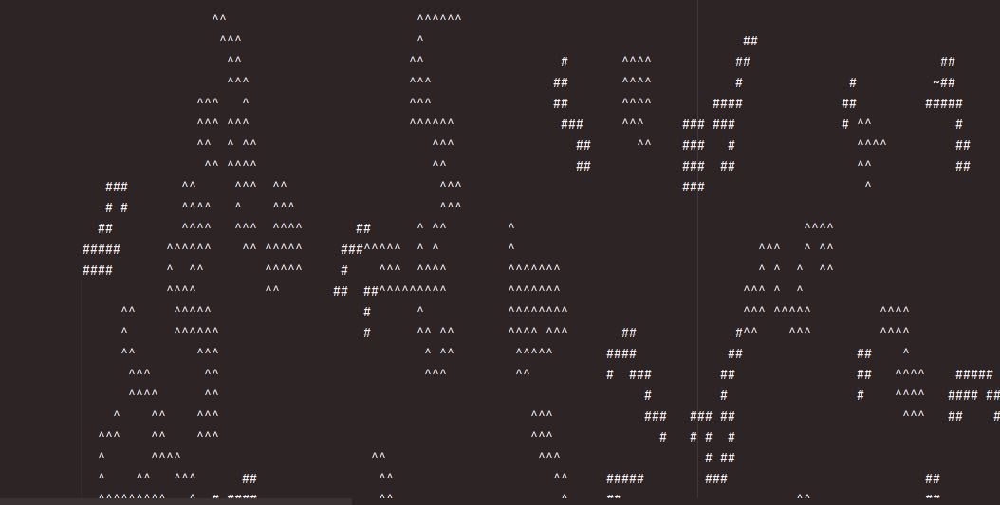

# Mars-exploration-1

## Overview
Mars exploration is a Java project designed to support the ambitious journey of human colonization of Mars.
By simulating various Martian terrains, the project aids in preparing for the challenges that lie ahead in real-world exploration and colonization efforts. This application generates randomized maps of Mars, tailored to specific customizable requirements to ensure a broad range of scenario simulations.

## Getting Started
Run the `Application` class (which is the main class) to start the application. The program will prompt you to enter the dimensions of the map and the name of the file where the map will be saved. The map will be generated based on the specified dimensions and saved in the specified file.

## Features
- Dynamic Map Configuration: Users are prompted to define map dimensions and the name for the file where the map will be created.
- Terrain and Resource Simulation: Generates four primary types of objects - mountains (^), pits (#), minerals (*), and water (~), with each terrain and resource following specific placement rules to mimic real Mars landscapes.
- Customizable Terrain Elements: Allows configuration of multiple terrain types and their areas, alongside strategic placement of resources like minerals and water next to corresponding terrain features.
- Shape Generation and Placement: Employs algorithms to create realistic shapes and layouts for terrain features, ensuring every map is unique and adheres to the specified requirements.
- Resource Placement Logic: Implements intelligent placement strategies for minerals and water, enhancing the realism and utility of the generated maps.
- Configuration Validation: Includes a validation system to ensure the feasibility of specified configurations, preventing errors or unrealistic map generation.
- Extensibility and Scalability: Designed with the principles of SOLID, SLAP, and YAGNI, facilitating future enhancements and maintenance.

## Screenshot
Below is an example of a generated Mars map. The screenshot includes various resources and landforms represented by symbols, as described in the legend:

- `^` : Mountain
- `#` : Pit
- `*` : Mineral
- `~` : Water

